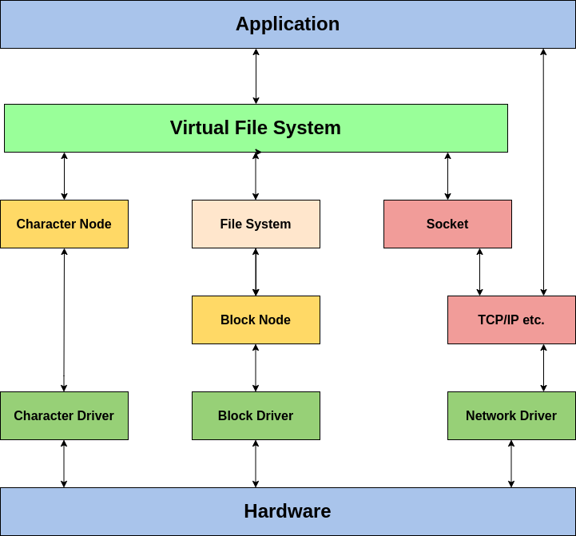
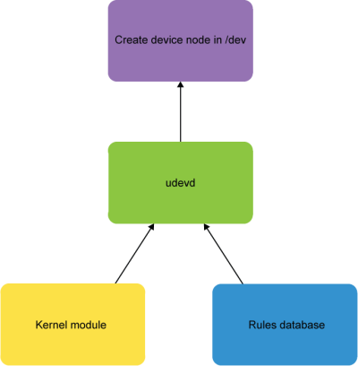

# Devices

## udev

udev stands for User Device management. It dynamically discovers built-in hardware as well as peripheral devices:

during system boot
when hotplugged (at any time)
udev handles loading and unloading device drivers with proper configurations, as need, and its tasks include:

Device naming
Device file and symlink creating
Setting file attributes
Taking needed actions
When devices are added or removed from the system, udev receives a message from the kernel. It then parses the rules files in the **/etc/udev/rules.d** directory to see if any rules are there for the device added or removed.

These rules are totally customizable and can specify device file names, device file creation, specify symlinks to be created, specify file attributes to be set for the device file (including user and group ownership), and even specify actions to be taken (programs to be executed).

# Device Nodes

Character and block devices have device nodes; network devices do not. These device nodes can be used by programs to communicate with devices through nodes using normal I/O methods.

A device driver may use multiple device nodes. Device nodes are located in the **/dev** directory.

```sh
ls -l /dev
```

Device nodes can be created with the following command:

```sh
# sudo mknod [-m mode] /dev/name <type> </major> <minor>
  sudo mknod -m 666 /dev/mycdrv c 254 1
```




# udev Components
udev runs as a daemon (either udevd or systemd-udevd) and monitors a netlink socket. When new devices are initialized or removed, the uevent kernel facility sends a message through the socket, which udev receives and takes appropriate action to create or remove device nodes of the right names and properties according to the rules.

The three components of udev are:

The **libudev** library which allows access to information about the devices.
The **udevd** or **systemd-udevd** daemon that manages the **/dev** directory.
The **udevadm** utility for control and diagnostics.
The cleanest way to use udev is to have a pure system; the **/dev** directory is empty upon the initial kernel boot, and then is populated with device nodes as they are needed. When used this way, one must boot using an initramfs image, which may contain a set of preliminary device nodes, as well as the the udev infrastructure.





# udev Rule Files
udev rules files are located under **/etc/udev/rules.d/<rulename>.rules** and **/usr/lib/udev/rules.d/<rulename>.rules** with names like:

* 30-usb.rules
* 90-mycustom.rules
* 70-mouse.rules
* 60-persistent-storage.rules

There are two separate parts defined on a single line:

The first part consists of one or more match pairs denoted by ==. These try to match a device’s attributes and/or characteristics to some value.
The second part consists of one or more assignment key-value pairs that assign a value to a name, such as a file name, assignment, even file permissions, etc.
If no matching rule is found, it uses the default device node name and other attributes.

Command:
```sh
 cat /etc/udev/rules.d/99-fitbit.rules
```

Output:
```sh
SUBSYSTEM=="usb", ATTR{idVendor}=="2687", ATTR{idProduct}=="fb01", SYMLINK+="fitbit", MODE="0666"
```

Command:
```sh
 cat /etc/udev/rules.d/60-vboxdrv.rules
```


Output:
```sh
KERNEL=="vboxdrv", NAME="vboxdrv", OWNER="root", GROUP="vboxusers", MODE="0660"
KERNEL=="vboxdrvu", NAME="vboxdrvu", OWNER="root", GROUP="root", MODE="0666"
KERNEL=="vboxnetctl", NAME="vboxnetctl", OWNER="root", GROUP="vboxusers", MODE="0660"
SUBSYSTEM=="usb_device", ACTION=="add", RUN+="/usr/lib/virtualbox/VBoxCreateUSBNode.sh $major $minor $attr{bDeviceClass}"
SUBSYSTEM=="usb", ACTION=="add", ENV{DEVTYPE}=="usb_device",
RUN+="/usr/lib/virtualbox/VBoxCreateUSBNode.sh $major $minor $attr{bDeviceClass}"
SUBSYSTEM=="usb_device", ACTION=="remove", RUN+="/usr/lib/virtualbox/VBoxCreateUSBNode.sh --remove $major $minor"
SUBSYSTEM=="usb", ACTION=="remove", ENV{DEVTYPE}=="usb_device",
RUN+="/usr/lib/virtualbox/VBoxCreateUSBNode.sh --remove $major $minor"
```

# Creating udev Rules
The format for a udev rule is simple:
```sh
<match><op>value [, ...] <assignment><op>value [, ... ]
```

Rules files can be in three places, and if they have same name the priority order is:

* /etc/udev/rules.d
* /run/udev/rules.d
* /usr/lib/udev/rules.d

There are two separate parts defined on a single line. The first part consists of one or more match pairs (denoted by double equal signs). These will match a device’s attributes and/or characteristics to some value. The second part consists of one or more assignment key-value pairs that assign a value to a name, such as a filename, group assignment, or even file permissions.

Samples:
```sh
KERNEL=="sdb", NAME="my-spare-disk"
KERNEL=="sdb", DRIVER=="usb-disk", SYMLINK+="sparedisk"
KERNEL=="sdb", RUN+="/usr/bin/my-program"
KERNEL=="sdb", MODE="0660", GROUP="mygroup"
```

If no matching rule is found, it uses the default device node name.

See man udev for explanation of the key values such as SYMLINK and RUN.

# Examples of Rules Files

Here is an example of a rules file for a Fitbit device (command and output):
```sh
cat /usr/lib/udev/rules.d/99-fitbit.rules
SUBSYSTEM=="usb", ATTR{idVendor}=="2687", ATTR{idProduct}=="fb01", SYMLINK+="fitbit", MODE="0666"
```

Here is an example for creating crash dumps and fast kernel loading with kdump/kexec (command and output):

$ cat /usr/lib/udev/rules.d/98-kexec.rules
SUBSYSTEM=="cpu", ACTION=="add", PROGRAM="/bin/systemctl try-restart kdump.service"
SUBSYSTEM=="cpu", ACTION=="remove", PROGRAM="/bin/systemctl try-restart kdump.service"
SUBSYSTEM=="memory", ACTION=="online", PROGRAM="/bin/systemctl try-restart kdump.service"
SUBSYSTEM=="memory", ACTION=="offline", PROGRAM="/bin/systemctl try-restart kdump.service"

Here is an example for the kvm virtual machine hypervisor (command and output):

$ cat /usr/lib/udev/rules.d/80-kvm.rules
KERNEL=="kvm", GROUP="kvm", MODE="0666"
