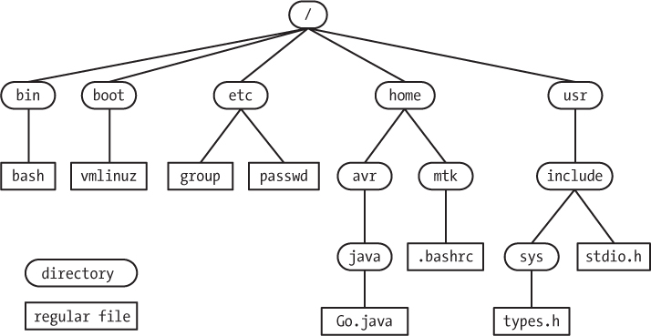

# FileSystem Features

## lssattr and chattr

Extended attributes associate metadata not interpreted directly by filesystem with files. Four namespaces exist: user, trusted, security and system. The system namespace is used for Access Control List(ACLs) and security namespace is used by SELinux

Flag values are stored in the file inode and may be modified and set only by the root user. They are viewed with **lsattr** and set with **charrt**. Flags may be set for files

Flags

|   |   |
|---|---|
| i: Inmutable| It cant be modified, deleted or renamed even by root. Not hardlink can be created on it, and no data can be written to the file. Only super user can set or clear this attribute  | 
| a: Append-only | A file with append-only attribute can set only be opened in append mode for writing. Only the super user can set or clir this attribute  | 
| d: No-dump  |  A file with the no-dump attribute set is ignored when the dump program is run, this is useful for swap and cache files that you dont want to waste time backing up |   
A: no atime update| A file with no atime update will not modify it atime(access time)  recored when the file is accessed but not otherwise modified. This can increase the performance on some systems because it reduces the amount of disk I/O|


    chattr +|-|=mode filename


```sh
# makes /etc/resolv.conf inmutable
sudo chattr +i /etc/resolv.conf

# atime test.txt
chattr +A test.txt


# list filename attrs
lsattr filename
```

## mkfs

Utility for formatting a filesystem partition. The generic name for these utilities is **mkfs**. However, this is a forntend for filesystem-specific programs, each of which may have particular options


    mkfs [-t fstype] [options] [device-file]

where [device-file] is usually a device name like /dev/sda3 or /dev/vg/lvm1.

The following two commands are entirely equivalent:

```sh
 sudo mkfs -t ext4 /dev/sda10

 sudo mkfs.ext4 /dev/sda10
 ```

Each filesystem type has its own particular formatting options and its own mkfs program

## fsck

utility designed to check for errors (and hopefully fix any that are found). The generic name for these utilities is fsck. However, this is just a frontend for filesystem-specific programs.

    fsck [-t fstype] [options] [device-file]

where [device-file] is usually a device name like ***/dev/sda3*** or ***/dev/vg/lvm1***. Usually, you do not need to specify the filesystem type, as fsck can figure it out by examining the superblocks at the start of the partition.

You can control whether any errors found should be fixed one by one manually with the -r option, or automatically, as best possible, by using the -a option, etc. In addition, each filesystem type may have its own particular options that can be set when checking.

Note that journalling filesystems are much faster to check than older generation filesystems for two reasons:

* You rarely need to scan the entire partition for errors, as everything but the very last transaction has been logged and confirmed, so it takes almost no time to check.​
* Even if you do check the whole filesystem, newer filesystems have been designed with fast fsck in mind; older filesystems did not think much about this when they were designed as sizes were much smaller.


The following two commands are entirely equivalent:

```sh
    sudo fsck -t ext4 /dev/sda10

    sudo fsck.ext4 /dev/sda10
 ```

If the filesystem is of a type understood by the operating system, you can almost always just run the following command:

```sh
 sudo fsck /dev/sda10
```

The system will figure out the type by examining the first few bytes on the partition.

**fsck** is run automatically after a set number of mounts or a set interval since the last time it was run or after an abnormal shutdown. It should only be run on unmounted filesystems. 


You can force a check of all mounted filesystems at boot by running these commands:

```sh
 sudo touch /forcefsck

 sudo reboot
```


The file /forcefsck will disappear after the successful check. One reason this is a valuable trick is it can do a fsck on the root filesystem, which is hard to do on a running system.


## Mounting Filesystems

All accessible files in Linux are organized into one large hierarchical tree structure with the head of the tree being the root directory (/). 



<BR>
However, it is common to have more than one partition (each of which can have its own filesystem type) joined together in the same filesystem tree. These partitions can also be on different physical devices, even on a network.

The **mount** program allows attaching at any point in the tree structure; **umount** allows detaching them.

***The mount point is the directory where the filesystem is attached***. It must exist before mount can use it; **mkdir** can be used to create an empty directory. ***If a pre-existing directory is used and it contains files prior to being used as a mount point, they will be hidden after mounting***. These files are not deleted and will again be visible when the filesystem is unmounted.

By default, only the superuser can mount and unmount filesystems.

Each filesystem is mounted under a specific directory, as in the following command:

```sh
  mount -t ext /dev/sdb4 /home
```


* Mounts an ext4 filesystem.
* Usually not necessary to specify the type with the -t option.
* The filesystem is located on a specific partition of a hard drive (/dev/sdb4).
* The filesystem is mounted at the position /home in the current directory tree.
* Any files residing in the original /home directory are hidden until the partition is unmounted.